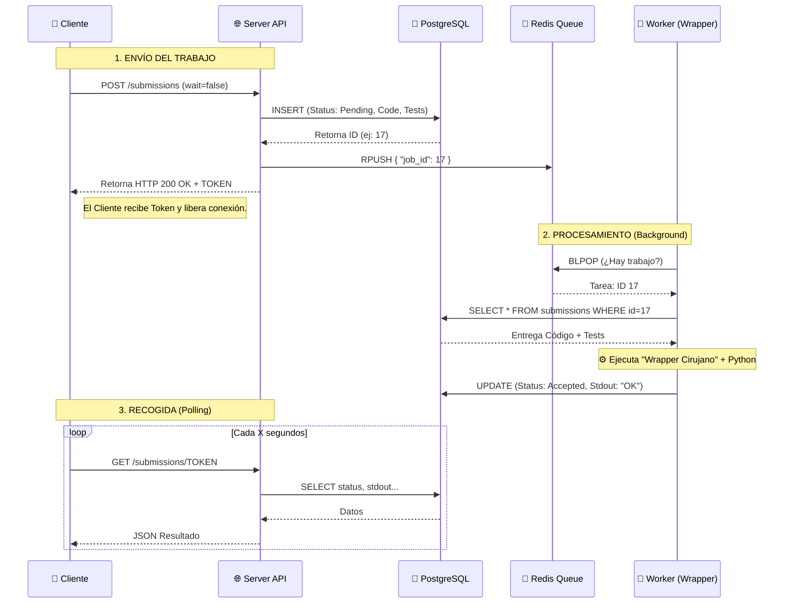
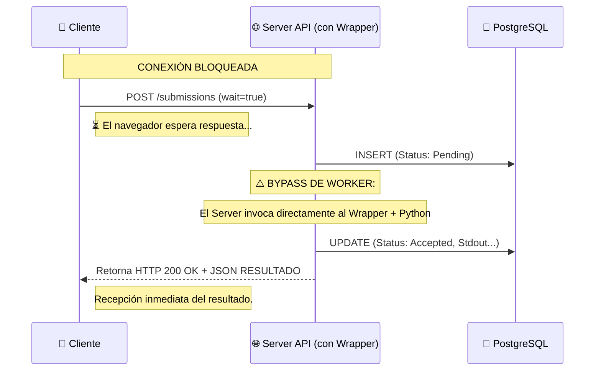

<!-- arquitectura_flujos_judge0.md -->

# Documentación Técnica: Arquitectura de Flujos (Judge0)

**Proyecto:** Plataforma de Evaluación de Código

**Módulo:** Motor de Evaluación (Judge0)

**Componentes:** API Server, Worker, Redis, PostgreSQL.

---

## 1. Diagramas de Secuencia

Ilustración del comportamiento del sistema ante solicitudes síncronas y asíncronas para la evaluación de código.

### A. Flujo ASÍNCRONO (`wait=false`)

_Escenario típico de producción: Alta concurrencia, el cliente no bloquea la conexión._

**Componentes:**

- **Cliente:** Frontend / Usuario.
- **Server:** Pod `judge0-server` (API Gateway).
- **Redis:** Cola de mensajería para desacoplamiento.
- **Worker:** Pod `judge0-worker` (Procesamiento con Wrapper de compatibilidad).
- **DB:** PostgreSQL (Persistencia de resultados).



### B. Flujo SÍNCRONO (`wait=true`)

_Escenario de pruebas o baja latencia: El servidor procesa la petición en el mismo hilo HTTP._



---

## 2. Referencia de API

Ejemplos de consumo para integración con Frontend.

### A. Enviar Solución (Modo Síncrono)

_Endpoint:_ `POST /submissions/?base64_encoded=true&wait=true`

```bash
curl -X POST "http://<JUDGE0_HOST>:2358/submissions/?base64_encoded=true&wait=true" \
     -H "Content-Type: application/json" \
     -d '{
    "language_id": 71,
    "source_code": "aW1wb3J0IHVuaXR0ZXN0CgojIC0tLSBDT0RJR08g..."
}'
```

### B. Consultar Resultado (Modo Asíncrono)

_Endpoint:_ `GET /submissions/<TOKEN>?base64_encoded=true`

```json
{
  "stdout": null,
  "time": "0.067",
  "memory": 0,
  "stderr": "Li4uLi4uCi0tLS0tLS0t...",
  "status": {
    "id": 3,
    "description": "Accepted"
  }
}
```
